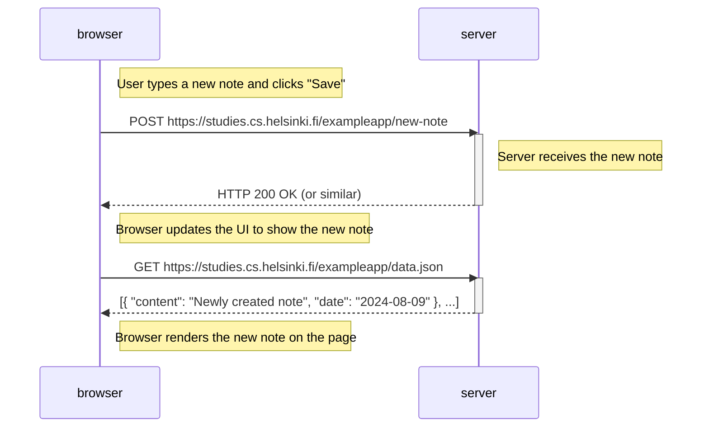

```mermaid
sequenceDiagram
    participant browser
    participant server

    Note right of browser: User types a new note and clicks "Save"

    browser->>server: POST https://studies.cs.helsinki.fi/exampleapp/new-note
    activate server
    Note right of server: Server receives the new note
    server-->>browser: HTTP 200 OK (or similar)
    deactivate server

    Note right of browser: Browser updates the UI to show the new note

    browser->>server: GET https://studies.cs.helsinki.fi/exampleapp/data.json
    activate server
    server-->>browser: [{ "content": "Newly created note", "date": "2024-08-09" }, ...]
    deactivate server

    Note right of browser: Browser renders the new note on the page
```
